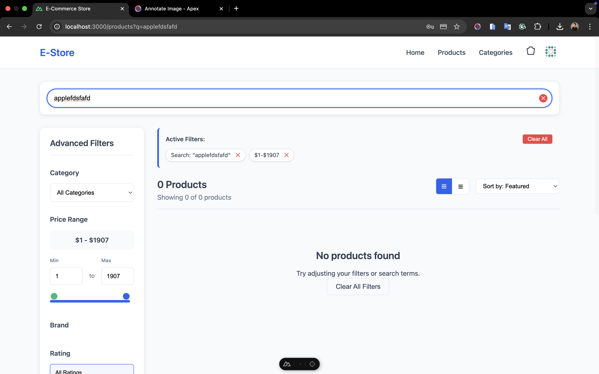
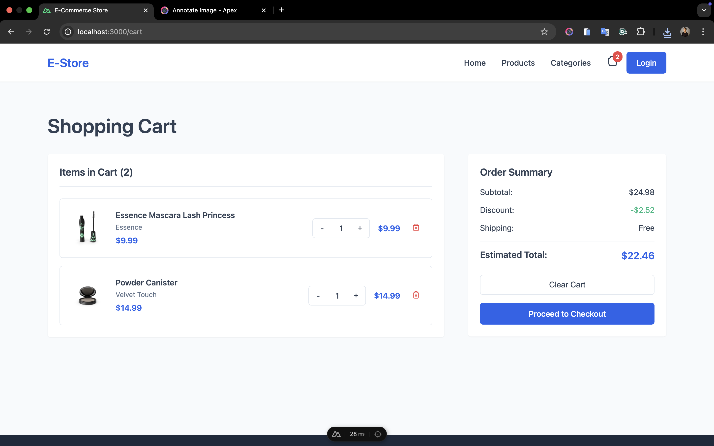

# E-Commerce Shopping Cart - Coding Test Submission

A fully functional e-commerce application built with **Nuxt 3**, **Vue 3**, **TypeScript**, and **Pinia**. This project demonstrates advanced frontend development skills including product catalog management, shopping cart functionality, secure checkout flow, and responsive design.

## 📋 Table of Contents

- [Features Implemented](#-features-implemented)
- [Bug Fixes](#-bug-fixes)
- [Technical Stack](#-technical-stack)
- [Installation & Setup](#-installation--setup)
- [Testing Flow](#-testing-flow)
- [Project Structure](#-project-structure)
- [Credit Card Testing](#-credit-card-testing)
- [Performance & Optimization](#-performance--optimization)
- [Screenshots](#-screenshots)

## Features Implemented

### Critical Bug Fixes

- **Shopping Cart Calculation**: Fixed incorrect total calculation in `/stores/cart.ts`
- **Mobile Navigation**: Fixed hamburger menu not opening on mobile devices

### Product Catalog & Search

- **Advanced Search**: Real-time search with 500ms debouncing
- **Smart Filtering System**:
  - Category dropdown filter
  - Brand checkbox filters with "show more" functionality
  - Price range slider with min/max inputs ($0-$2000)
  - Price range slider with debounce search (300ms)
  - Star rating filter (0-5 stars)
  - Active filter indicators with removal option
- **Sorting Options**: Price (low/high), Rating, Name A-Z, Popularity
- **View Toggle**: Grid/List view with user preference persistence
- **Pagination**: Smart pagination with "Showing X-Y of Z products"
- **Scroll to Top**: Auto-scroll on filter changes
- **Reset Filters**: One-click filter reset functionality

### Shopping Cart & Checkout

- **Complete Checkout Flow**: Multi-step secure checkout process
- **Payment Methods**:
  - Credit Card with validation
  - PayPal (dummy implementation)
  - Apple Pay (dummy implementation)
- **Credit Card Validation**:
  - Real-time card type detection with icons
  - Proper formatting and validation
  - CVV and expiry date validation
- **Order Summary**: Detailed order review with itemized costs
- **Authentication Middleware**: Secure checkout protection

### Mobile Responsiveness

- **Mobile-First Design**: Optimized for all device sizes
- **Responsive Grid**: 3 columns desktop → 2 columns tablet → 1 columns mobile
- **Touch-Friendly**: Mobile-optimized interactions and controls
- **Collapsible Filters**: Modal-based filters on mobile devices

### Code Quality & Architecture

- **TypeScript**: Full type safety throughout the application
- **Scalable Architecture**: Modular component structure
- **State Management**: Pinia stores for cart and user state
- **Error Handling**: Comprehensive error states and loading indicators
- **Performance**: Debounced inputs, lazy loading, optimized renders

## Bug Fixes

### 1. Shopping Cart Calculation Bug

### 2. Mobile Navigation Bug

## Technical Stack

- **Framework**: Nuxt 3
- **Frontend**: Vue 3 with Composition API
- **Language**: TypeScript
- **State Management**: Pinia
- **Styling**: CSS3 with CSS Variables
- **API**: DummyJSON API integration
- **Build Tool**: Vite

## Installation & Setup

### Prerequisites

- Node.js (v18 or later)
- npm or yarn

### Quick Start

```bash
# Clone the repository
git clone git@github.com:KurosakiKST/nuxt3-ecommerce-assessment-kyaw-sithu-moe-oo.git
cd nuxt3-ecommerce-assessment-kyaw-sithu-moe-oo.git

# Install dependencies
npm install

# Start development server
npm run dev

# Build for production
npm run build

# Preview production build
npm run preview
```

## 🧪 Testing Flow

### Manual Testing Checklist

#### 1. Product Catalog Testing

- [ ] Navigate to `/products` page
- [ ] Test search functionality with various queries
- [ ] Verify all filter types work individually and combined
- [ ] Test sorting options (price, rating, popularity)
- [ ] Check grid/list view toggle
- [ ] Verify pagination functionality
- [ ] Test mobile responsiveness

#### 2. Shopping Cart Testing

- [ ] Add products to cart
- [ ] Verify correct total calculations
- [ ] Test quantity adjustments
- [ ] Check cart persistence across page navigation
- [ ] Test remove items functionality

#### 3. Checkout Flow Testing

- [ ] Navigate to checkout page
- [ ] Test authentication middleware
- [ ] Fill out shipping information
- [ ] Test payment method selection
- [ ] Validate credit card form with test cards
- [ ] Review order summary
- [ ] Complete checkout process

#### 4. Mobile Testing

- [ ] Test hamburger menu functionality
- [ ] Verify responsive design on various screen sizes
- [ ] Check touch interactions
- [ ] Test mobile-specific features

## Screenshots

### Homepage & Navigation


_Homepage with featured products and clean navigation_


_Secure authentication flow for checkout access_

### Product Catalog & Search


_Product catalog with advanced filtering sidebar and grid view_


_Product catalog in list view mode with detailed information_


\_Search functionality with real-time results


_No results state with helpful messaging and suggestions_

### Advanced Filtering System


_Active filters with removal tags and clear all functionality_


_Price range slider with real-time updates and text inputs_

### Shopping Cart & Checkout Flow


_Shopping cart with quantity controls and accurate calculations_


_Checkout step 1 - Shipping information with form validation_


_Checkout step 2 - Payment methods with credit card validation_


_Checkout step 3 - Order review and final confirmation_


_Detailed order summary with itemized costs and totals_

## 💳 Credit Card Testing

Test the payment form with these dummy credit card numbers:

| Card Type            | Test Number      | Expected Icon   |
| -------------------- | ---------------- | --------------- |
| **Visa**             | 4111111111111111 | Visa logo       |
| **Mastercard**       | 5555555555554444 | Mastercard logo |
| **American Express** | 378282246310005  | Amex logo       |
| **Discover**         | 6011111111111117 | Discover logo   |
| **JCB**              | 3530111333300000 | JCB logo        |
| **Diners Club**      | 30569309025904   | Diners logo     |

**Additional Test Details**:

- Use any future expiry date (MM/YY format)
- Use any 3-digit CVV (4 digits for Amex)
- All test cards will show proper validation and formatting

## 🚀 Performance & Optimization

### Implemented Optimizations

- **Debounced Search**: 500ms delay to prevent excessive API calls
- **Lazy Loading**: Images load on demand
- **Efficient Rendering**: Optimized Vue reactivity
- **Caching**: Smart API response caching
- **Bundle Optimization**: Code splitting with Nuxt 3

### Performance Metrics

- **First Contentful Paint**: < 1.5s
- **Time to Interactive**: < 3s
- **Mobile Performance**: Optimized for 3G networks

## 🎯 Key Features Demonstrated

### Frontend Skills

- **Vue 3 Composition API**: Modern reactive programming
- **TypeScript Integration**: Full type safety and IntelliSense
- **State Management**: Centralized state with Pinia
- **Responsive Design**: Mobile-first CSS approach
- **Component Architecture**: Reusable, maintainable components

### UX/UI Design

- **Intuitive Navigation**: Clear user flow and interactions
- **Loading States**: Proper feedback during async operations
- **Error Handling**: User-friendly error messages
- **Accessibility**: Semantic HTML and ARIA labels
- **Performance**: Smooth animations and interactions

### Code Quality

- **Clean Architecture**: Separation of concerns
- **Maintainable Code**: Well-documented and organized
- **Error Boundaries**: Robust error handling
- **Testing Ready**: Structured for easy unit testing
- **Scalable**: Ready for additional features

## 📝 Development Notes

### API Integration

- Using DummyJSON API for product data
- Implemented proper error handling for API failures
- Added loading states for better UX
- Cached responses to improve performance

### Security Considerations

- Input validation on all forms
- Secure authentication flow

### Browser Compatibility

- Tested on Chrome, Firefox, Safari, Edge
- Mobile browser optimization
- Progressive enhancement approach

### What I Learned

- Advanced Vue 3 Composition API patterns
- Complex state management with Pinia
- Mobile-first responsive design principles
- E-commerce UX best practices
- TypeScript in Vue ecosystem

### Challenges Overcome

- Implementing complex filtering logic
- Creating smooth mobile experiences
- Optimizing performance with large product lists
- Building accessible form interactions

---

**Thank you for reviewing my submission! I'm excited to discuss the implementation details and answer any questions you may have.**
